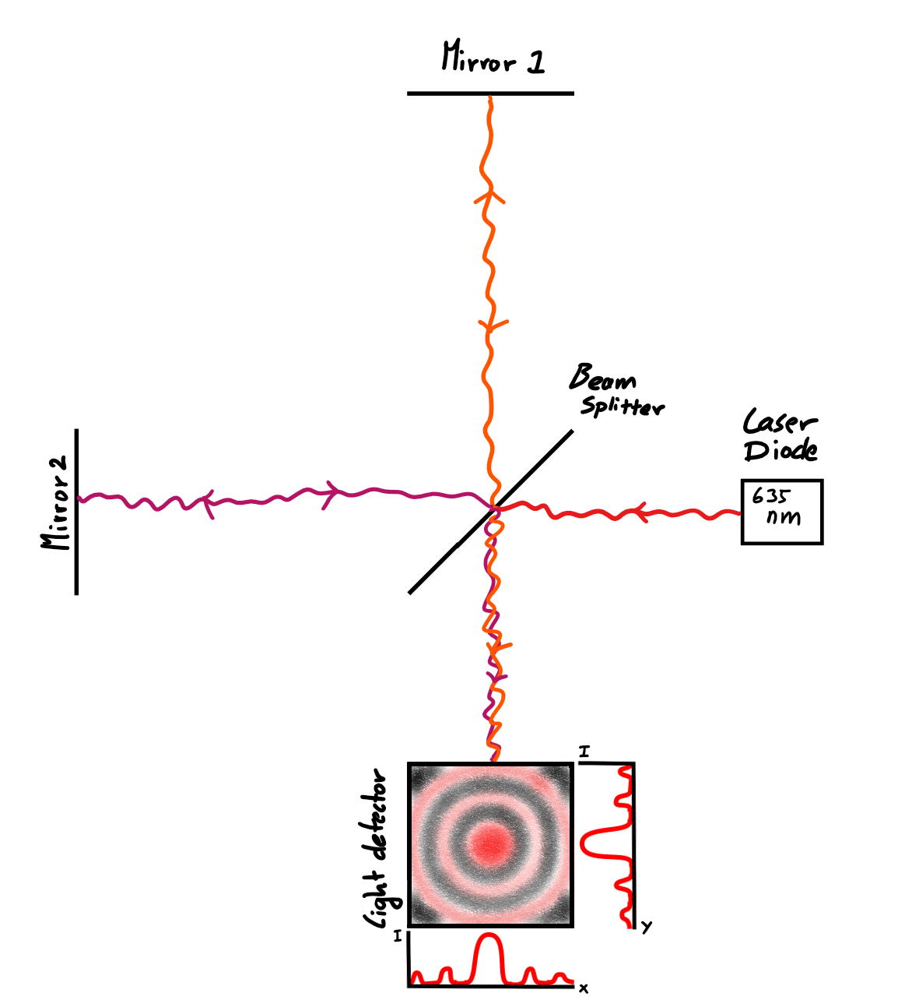

# What is a Michelson Interferometer?

The Michelson Interferometer uses in it simplest form only 5 optical elements (see figure below). Light from a laser, in our case a red laser diode, is directed at the beam splitter. Here half of the laser light is reflected to mirror 1 and the other half is transmitted to mirror 2. The two separated beams will be reflected at the mirrors and the light will recombine at the beam splitter. Here once again half is reflected and half is transmitted, but this time both light beams go towards the light detector and are recombined. If both mirrors have the same distance to the beam splitter the recombination gives a fringe pattern on the detector with a circular light spot surrounded by a dark ring. This ring is followed by a light ring and another dark ring and so forth, as can be seen in the figure below.

This effect also works if the difference of the pathlength from a mirror to the beam splitter is exactly one wavelength difference. If it is half a wavelength difference the pattern will be inverted, and if the pathlength changes over time you will cycle through these two patterns. One of these cycles corresponds exactly to one wavelength of your light source.

*An example of the simplest form of an Michelson Interferometer. If the setup is properly aligned the pattern on the light detector will look like shown.*
