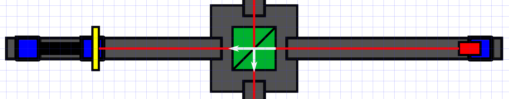

# Adding the beam splitter

Next we add the beam splitter in the center of the frame. This is a relatively simple part, but it is also crucial it is aligned properly. Screw it into the center of the frame and pay attention to the markings on top.  

*If aligned properly, the mirror and laser diode pair we just set-up should remain aligned. You can check this with a piece of paper or a target screen.*
