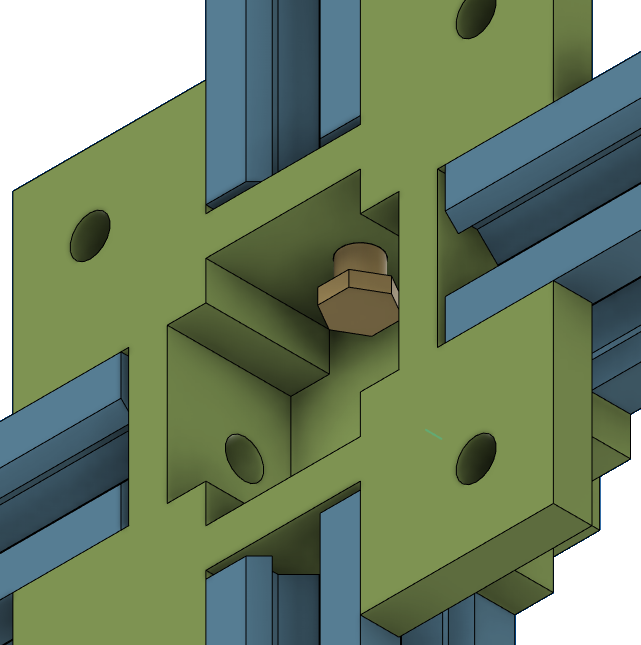

# Building the Base
We will now start building the actual setup. We will start by building the base, for which you need to centre-piece and the 4 aluminium extrusions. Furthermore you will need 4 M5 bolts. You will need to use these to bolt the 4 extrusions to the centre-piece like shown in the figure below.

Do this for all 4 extrusions and you are done with building the base! It should look like the figure below when viewed from the top.

