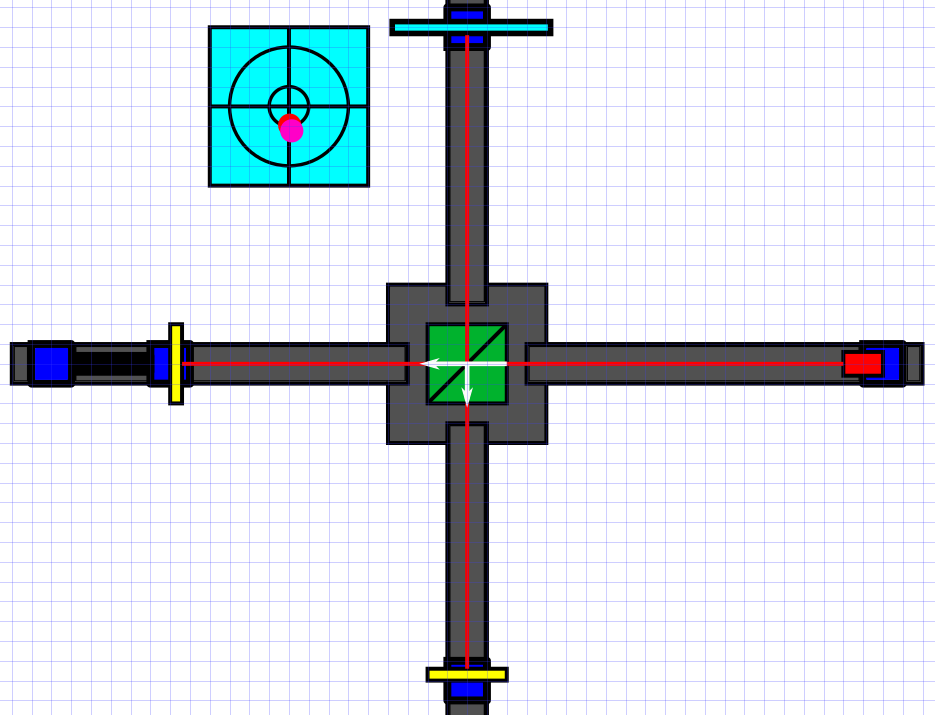

# Calibrating dot to dot

Now attach the second mirror at the same distance from the beam splitter as where the sample mirror is. You should now see two dots (or one if you're very lucky and it's already aligned) over the empty arm of the base. Now use the micro-screws on the second mirror to get the two dots to overlap. If you aligned everything perfectly, they should meet at the same location and you might already be able to see some interference patterns. However, this dot is very small and hard to see, so next we will add a lens to expand the beam.

*Note that the pink and red dot should overlap perfectly for proper alignment. In this image they are not aligned properly. Once again the horizontal alignment is more important than the vertical alignment.*
