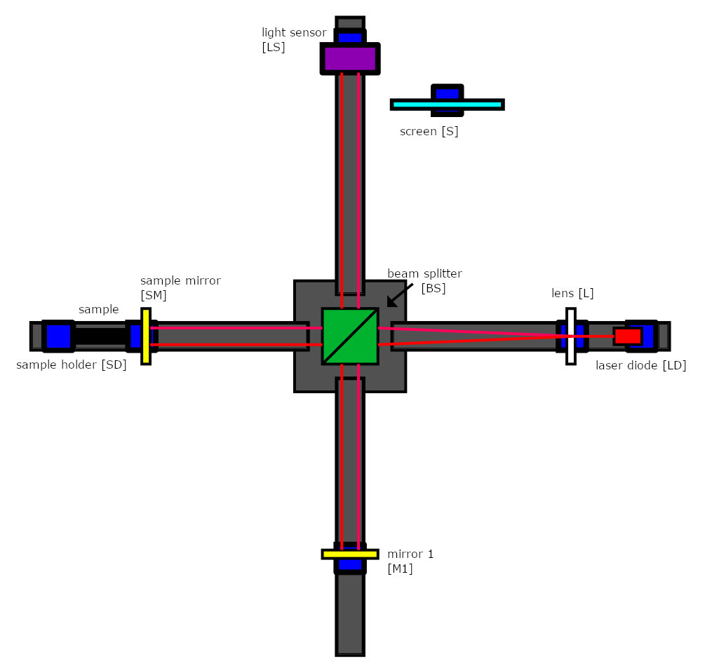

# Expanding the beam

Because the laser dot is so small, we will need to use a lens to expand it and make the interference pattern visible. This makes the intensity of the light weaker as it is spread over a larger area, but it is a trade-off that needs to be made to see the pattern and be able to detect it with our light sensor.

We found that a F=40mm lens, placed a couple of centimeters away from laser works best for our setup. If the laser strikes the lens off-center it will slightly bend the beam, messing up your alignment so take care to get it as central as possible. You might not be able to get it exactly right and you might therefore have to tweak the mirrors slightly. Once you have done so however you should be able to get a good interference pattern. Your interferometer should now look very similar to the full setup shown below.

*Your setup should now look like this with the exception of the light sensor.*
