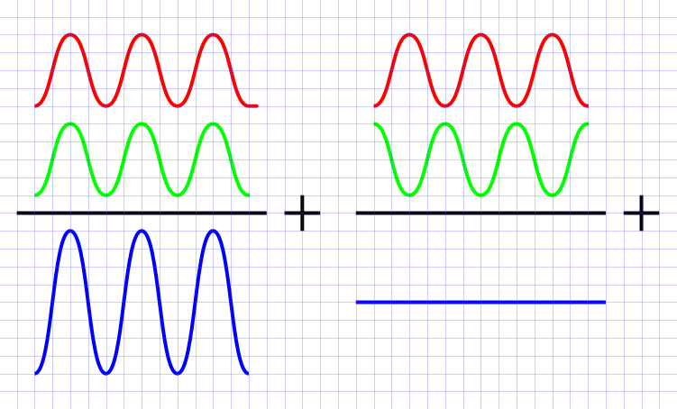

# What is an interferometer (and why should I care?)

Interferometry is the general term for a group of experimental techniques that use the phenomenon of interference by superposition to measure something. This usually means superimposing electromagnetic waves by adding up a two beams of electromagnetic waves. The simplest form of this phenomenon shown in the figure below.

*Example of how superimposing two waves on eachother works.*

 Interferometers use this to make measurements of very small displacements and the displacements that can be measured are related to the wavelength of your wave source. The interference patterns give you information on pathlengths of the waves you measure. Using electromagnetic waves as source the precision can be in the order of nanometers, which makes interferometers the instruments with the highest precision in measuring lengths.
