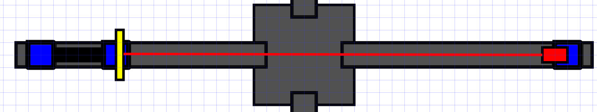

# laser and opposite mirror

## laser
 Start by attaching the laser to one of the sliders. Place it opposite of the sample holder. Try and get it level using the screws and manual adjustments to the laser position. You can check if it's level by holding the target screen (or piece of paper) in the path of the laser and seeing if it moves as you move the screen further away.

*You want the dot to be in the middle of the target horizontally, vertically it does not necessarily need to be in the middle, as long as it is at the same height everywhere and thus leveled properly.*

## opposite mirror

Next, attach the mirror opposite of the laser. Attach the mirror as straight as possible, and use the micro-screws to make some small adjustments. When aligned properly it should reflect the laser-light right back at the laser itself. Aligning it so that it shines right back into the laser diode is damaging to the diode, so try align it slightly above or below the diode's aperture. This should not interfere with the interferometer's functioning.

