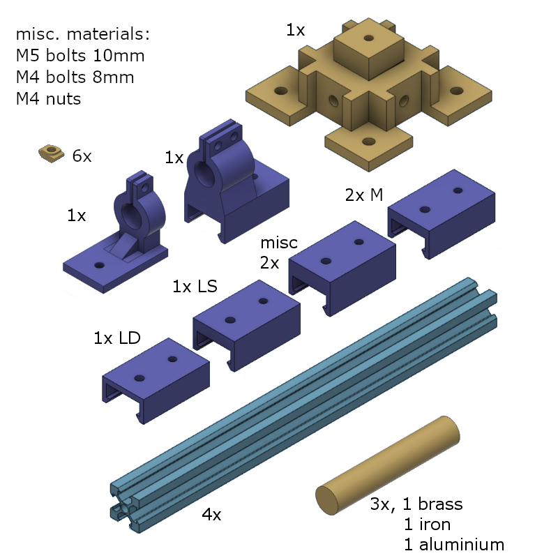

# What do you need to build our interferometer

The parts needed to build the setup discussed in the [previous chapter](./builid_start.md) can be split into two groups:
- the optical elements
- the structural elements

Originally we wanted to construct [our own optical elements salvaged from CD/DVD-readers](https://engineering.stackexchange.com/questions/2610/building-laser-interferometer-from-cd-dvd-drives-parts) (n.b. the lasers used in CD/DVD drives are [class 3B!](https://en.wikipedia.org/wiki/Laser_safety#Class_3R) so be careful!), but due to time constraints we used parts that were available in from our university's optics lab. These are [Thorlabs](https://www.thorlabs.com/) parts and include:
- two mirrors with their [mounts](https://www.thorlabs.com/thorproduct.cfm?partnumber=KM100T),
- one coherent light source, ([laser diode](https://www.thorlabs.com/thorproduct.cfm?partnumber=CPS635R)), with [mount](https://www.thorlabs.com/thorproduct.cfm?partnumber=KM100V)
- one [light sensor](https://www.thorlabs.com/thorproduct.cfm?partnumber=PDA36A-EC)
- one [beam splitter](https://www.thorlabs.com/thorproduct.cfm?partnumber=BS025) with its [mount](https://www.thorlabs.com/thorproduct.cfm?partnumber=CM1-DCH)
- one lens ([40mm focal range](https://www.thorlabs.com/thorproduct.cfm?partnumber=LA4306-B)), with its [mount](https://www.thorlabs.com/newgrouppage9.cfm?objectgroup_id=1433&pn=LMR1/M#9543)
- one target screen to test the beam alignment
- adjustable [iris aperture](https://www.thorlabs.com/thorproduct.cfm?partnumber=ID25/M)

With these optical elements in mind we designed a system of [2020 aluminium extrusions](https://nl.aliexpress.com/item/32870579280.html) and 3D printed parts to make the base structure upon which the optical elements could be mounted. The figure below shows you all the structural elements that were made and are needed to build our setup.

*All the parts needed to construct the base structure of our setup. Note the LD part is for the laser diode, the LS part for the light sensor, the misc. part for the lens and aperture/screen, the M part for the mirrors. The aluminium extrusions are 250mm long and the samples are 100mm long with a diameter of 12mm.*
