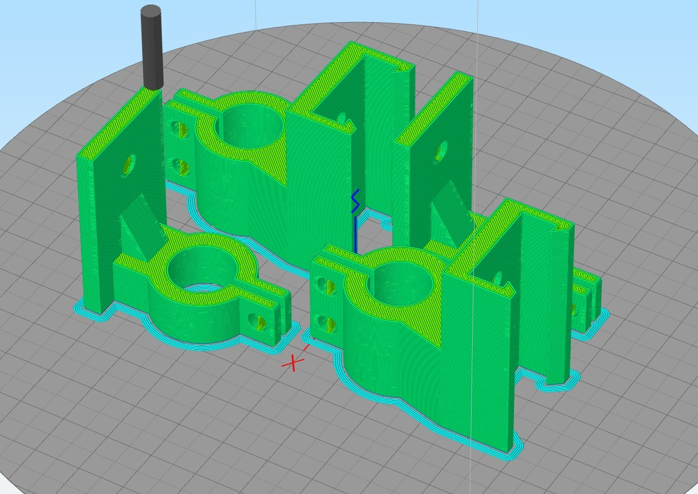

# Printing the parts

The 3D-printable structural parts for this experiment were modelled in [Fusion 360](https://www.autodesk.com/products/fusion-360/overview#banner) by Autodesk. The CAD files can be found in the [appendices](./CAD.md). The parts were designed with the idea that they can be simply fixed to the aluminium extrusions using simple bolts and nuts that are widely available.

Most of the 3D printed parts for this experiment were printed using an [Ultimaker 2+](https://ultimaker.com/3d-printers/ultimaker-2-plus) and the prints were prepared using the [free slicing software Cura](https://ultimaker.com/software/ultimaker-cura), which is published by Ultimaker. The Ultimaker 2+  is a [fused-filament-fabrication (FFF)](https://en.wikipedia.org/wiki/Fused_filament_fabrication#Fused_deposition_modeling) 3D-printer and the polymer used for the fabrication was [polyactic acid (PLA)](https://en.wikipedia.org/wiki/Polylactic_acid) filament.

Our prints were done using the standard 'fine' [slicing profile](https://en.wikipedia.org/wiki/Slicer_(3D_printing)) that Cura provides for the Ultimaker 2+. If the parts are not stiff or strong enough you might want to increase the shell thickness and infill. The most important settings for this profile are:
- 0.1mm layer height
- 0.27mm initial layer height
- 40% infill
- 0.4mm nozzle diameter
- 0.8mm shell thickness
- 50mm/s print speed
- supports enabled

The sample holder was printed using the [Formlabs 2](https://formlabs.com/), a [SLA resin printer](https://en.wikipedia.org/wiki/Stereolithography). This was done because this machine has a superior accuracy and the thermal stability of its polymer-material is better. The settings for these prints were:
- 100% infill (always the case for SLA printers)
- 0.05mm layer height

The orientation of the 3D models is sometimes very important for their strength in their intended usage. For most of our models this is not important, so one can orient them however needed for the best surface finish (this is just the way they were designed for our models). However, for the sample holder it is important to orient the model differently. For these models to be strong enough to withstand clamping the sample we need to have the curved surfaces of the clamp sliced in the XY-plane. This is simply done by orienting them as shown in the figure below.

