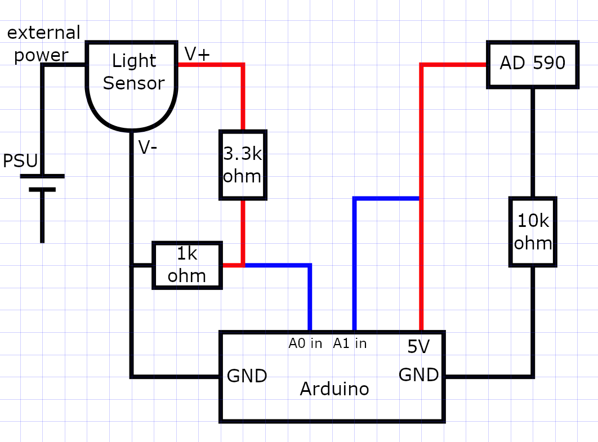

# Recording data

 In order to automatically record data we use an [Arduino Due](https://www.arduino.cc/en/Guide/ArduinoDue) to record the read-out of a [AD590 temperature trans-ducer](https://www.analog.com/en/products/ad590.html) and a [Thorlabs PDA36A-EC](https://www.thorlabs.com/thorproduct.cfm?partnumber=PDA36A-EC) gain detector to respectively measure the sample temperature and the light intensity at the center of our interference pattern. A cheaper Arduino and sensors will probably work just fine too.

## Attaching the circuitry
 The sensors should be wired in the following way:
 

 Our ciruit was wired up using a breadboard. If it's your first time working with a breadboard: these are simple board meant for rapid electronics prototyping. You can find a tutorial on them [here](http://wiring.org.co/learning/tutorials/breadboard/)

 Be careful when attaching the gain detector to the Arduino, as its maximum output voltage is 10V, more than the Arduino can handle. This is why we use two resistors as a voltage divider before connecting the sensor to the Arduino.

  The thermocouple should be attached to the sample. It has a metal plate on one side, this side should be pressed agains the sample and then taped down with electrical tape. Note that the samples are conductive and therefore care needs to be taken that the wiring does not touch the sample. A little bit of electrical tape underneath the sensor can help.

NOTE: the photodetector needs to be attached to its own power supply and that both the power-supply and the photodetector itself have an on-off switch. A green light should light up on the detector if it is turned on. Also make sure to put the photodector in its maximum gain mode (70dB) by turning the switch on top.
## Collecting data, Arduino code

Our latest code for driving the Arduino can be found on [our Github](https://github.com/HayleyDeckers/Experiment-Design-2019-uu/blob/master/src/AnalogReadSerial.ino). It is a relatively simple code, reading the values of the analog input `A0` and `A1` and a timestamp on each iteration. It contains some boilerplate code in the `setup` routine but the main lifting is done in the `loop` routine:

```c
DataPacket_t measurement;
// the loop routine runs over and over again forever:
void loop() {
  measurement.photosensor = analogRead(A0);
  measurement.timestamp_in_ms = millis();
  measurement.thermocouple = analogRead(A1);

  buffer[buffer_head] = measurement;
  buffer_head += 1;
  //if the buffer is now full
  if(buffer_head >= BUFFER_SIZE){
    //flush the buffer
    Serial.write((const char*)buffer, sizeof(measurement)*BUFFER_SIZE);
    //and reset the head
    buffer_head = 0;
  }
  delay(1); // delay in between reads for stability.
}
```

In order to program the Arduino, one should download the [Arduino IDE](https://www.arduino.cc/en/main/software) and flash the latest code from [our Github](https://github.com/HayleyDeckers/Experiment-Design-2019-uu/blob/master/src/AnalogReadSerial.ino) onto the board using this IDE. Detailed instructions can be found on the [Arduino website](https://www.arduino.cc/en/Guide/ArduinoDue).

## Collecting data, Python code
The Arduino will collect all the data for us, but we want to do the processing on a PC. That's why we developed a [small Python3 script](https://github.com/HayleyDeckers/Experiment-Design-2019-uu/blob/master/src/analogRead.py) for interfacing with the Arduino and storing the collected data into a file on our PC. Running the script below wil produce a file `out.bin` and populate it with binary data obtained from the Arduino. The program will loop infinitely and so you'll have to close it manually when you've finished collecting data. In order to run the script, you will need to install [Python 3](https://www.python.org/) and the [pyserial package](https://pypi.org/project/pyserial/). This can be done with `pip install pyserial` if pip is installed.
```python
import serial
from time import sleep
from struct import iter_unpack

PACKET_SIZE = 8
BYTES_PER_FRAME = 4096
PACKETS_PER_FRAME = BYTES_PER_FRAME/PACKET_SIZE
#TODO: make this a command line option
#NOTE: this has to be changed to "COM1" on Windows!
#the number might also vary per pc.
COM = '/dev/ttyACM1'# (Linux)
BAUD = 115200
#connect to the arduino over serial
ser = serial.Serial(COM, BAUD, timeout = 5)
#sleep for a little while so that we can actuall connect
sleep(3)
#send an identification payload
ser.write("THERMITE".encode('ascii'))
# and clear the read buffer up-to-and-including acknowledge from the Arduino
preface = ser.read_until(b'ACKN')
#now open a binary file to store our data into
f = open('out.bin', 'wb')
while True:
    #TODO: deal with not reading exactly 4096 bytes, won't corrupt data as iter_unpack will fail in that case but needs a nice solution.
    # easy solution would be to just round down the len. Better solution would be to packet the data.
    data = ser.read(BYTES_PER_FRAME)
    #read some data, the math and print statements are to watch progress on the terminal.
    sum_t = 0.0
    sum_i = 0.0
    y = iter_unpack("HHI",data)
    for measurement in y:
        sum_i += measurement[0]
        sum_t += measurement[1]
    sum_i /= PACKETS_PER_FRAME
    sum_t /= PACKETS_PER_FRAME
    #prints smoothed out data
    print(sum_t, " ", sum_i)
    #and copy the raw data to a file.
    f.write(data)
f.close()
```
