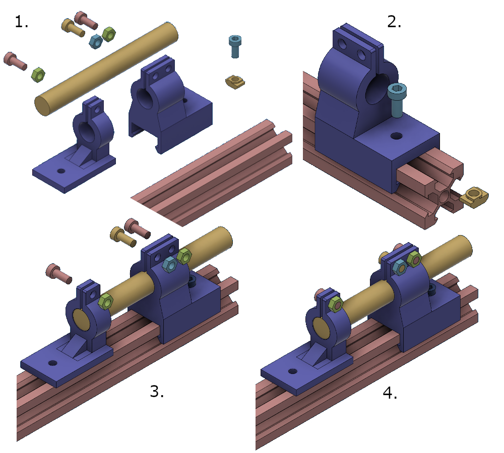

# Installing the sample holder

 1. In order to build the sample holder you will need these parts
 2. Attach the slider at the far-end of the rails and fasten it (if you attach the sample first, you won't be able to fasten it properly).
 3. Put the sample into the holder such that it's roughly centered. We recommend putting a piece of tape over the center of the sample beforehand, as we found that it really helps to get a snug fit. Affix the sample by using a two nuts and bolts to close the clamp on top. The sample should now be held firmly in place. Attach the floating slider to the sample. Make sure that it's approximately level and that it is not touching the base anywhere. If so, friction might prevent you from measuring any expansion. Once you hade made sure, affix it with another nut and bolt.

 4. If done correctly, it should look like this.
