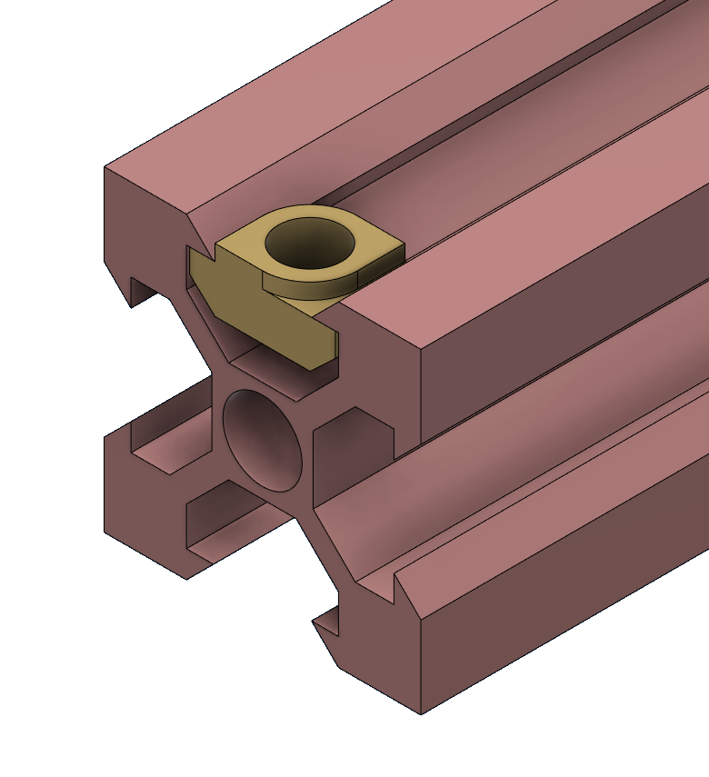
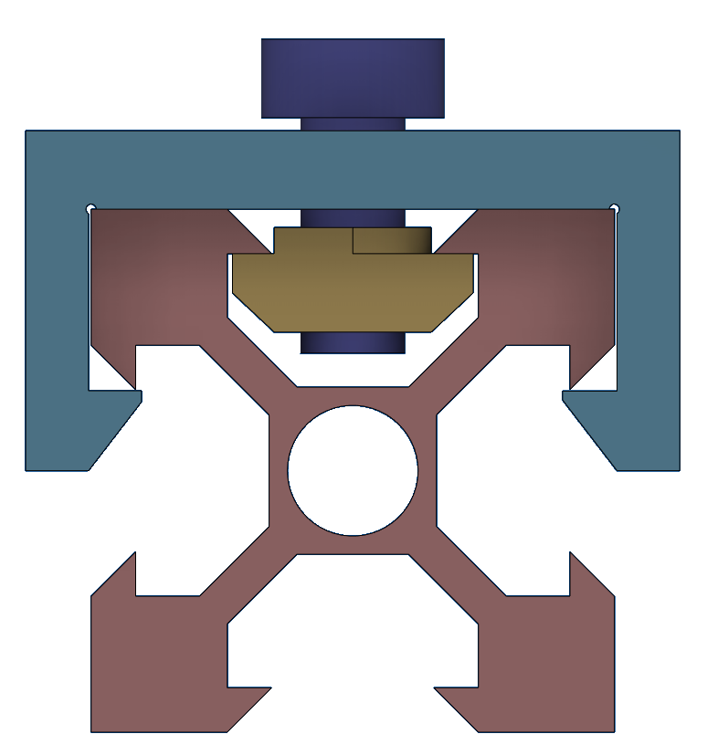

# Attaching the slide-on parts
Now we will show how the slide-on parts are fastened. These will hold all the optical elements on the aluminium extrusions. Note that not all the optical elements need to be fastened, most of them will fit snugly onto the extrusion and will be fine. Especially the mirrors and the sample should be fastened tightly. The first figure below shows a sliding nut that will be used to fasten the slide-on. Ensure that it is oriented like so when fastening the part.

The image below shows you how you can use a M4 bolt to tighten the part to the extrusion using the sliding nut. Once again it should be stressed if the sliding nut is not oriented properly it will not tighten properly.

