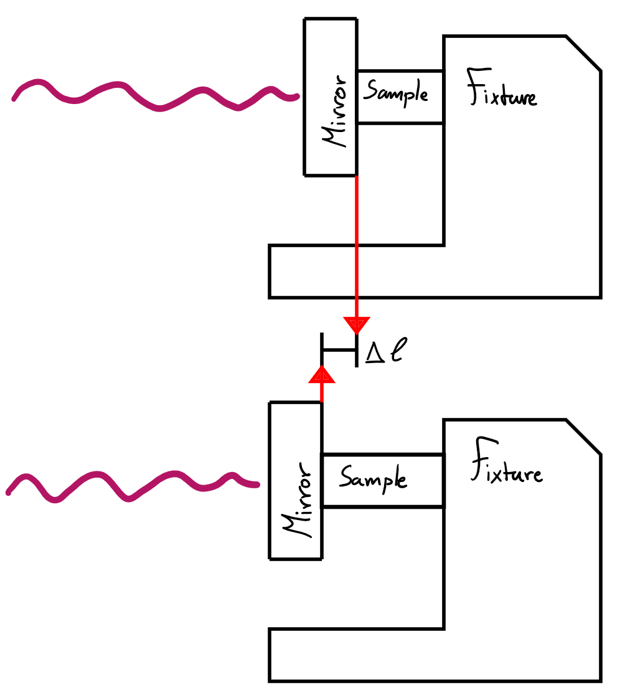

The phenomenon of cycling through the interference patterns is exactly what we will try to use in our experiment to measure changes in pathlength.\
The idea is simple:
1.	Fix all the optical elements except one mirror.
2.	Allow this mirror to move and thereby change its pathlength to the beam splitter.
3.	Measure how many times you went through a cycle of the fringe pattern for a given measurement period.
4.	Use this information to compute how much the pathlength has changed over that measurement period.

We wanted to build and design a setup for this concept and decided to measure the thermal expansion of a metal sample for our proof of concept. The design would have all elements fixed with one mirror attached to a metal sample that could be heated/cooled to make it expand or shrink. This will introduce the pathlength difference into our Interferometer, as shown in the figure below. By adding a simple temperature sensor we can then compare the expansion to the temperature difference and make a simple measurement of the thermal expansion coefficient for the sample.

*caption.*
